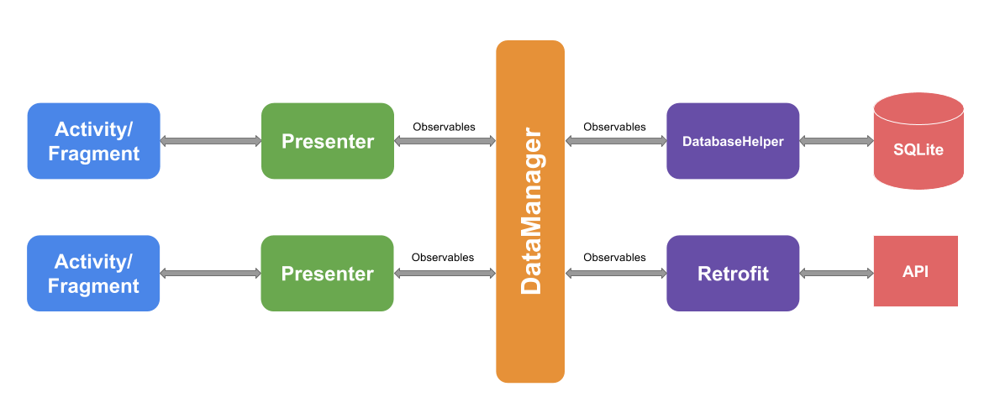

# Weather forecast app

An Android **MVP app** to use various Android concepts like MVP, RxJava, Dagger 2, Testing

## Architecture 

    

The architecture of this app was based upon https://github.com/ribot/android-guidelines/blob/master/architecture_guidelines/android_architecture.md with custom modifications like not using an Eventbus as this is not needed in an Rx flow based app. The app still uses the MVP Pattern for the presentation layer.

## Libraries

The libraries and tools used include:

- **Support library**
- **RecyclerViews and CardViews**
- **[RxJava](https://github.com/ReactiveX/RxJava)** and **[RxAndroid](https://github.com/ReactiveX/RxAndroid)**
- **[Retrofit](http://square.github.io/retrofit/)** and **[OkHttp](https://github.com/square/okhttp)**
- **[Dagger 2](http://google.github.io/dagger/)**
- **[Butterknife](https://github.com/JakeWharton/butterknife)**
- **[Espresso](https://google.github.io/android-testing-support-library/)**
- **[Mockito](http://mockito.org/)**

## Build Instructions

In order to run this project, you'll need to setup several things beforehand:

- This application uses the [OpenWeatherMap API](http://openweathermap.org) to obtain information about current weather and forecasts,
you'll need to register and obtain an API Key

- You'll need to set the values found in the [gradle.properties](gradle.properties) file.
This involves the OpenWeatherMap Api Key (`apiToken`)
